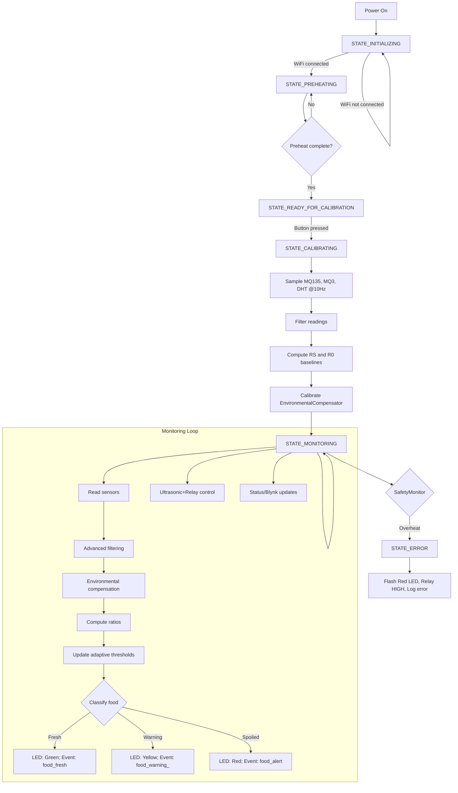

# System Flowchart

This flowchart captures the high-level control flow, state transitions, and core data processing steps. Render this using Mermaid (supported by many IDEs and markdown renderers).

Notes:
- Monitoring is non-blocking, paced by `SENSOR_READ_INTERVAL` and bounded by small `delay(10)` in `loop()`.
- Adaptive thresholds follow `spoiledBaseline × environmentalFactor` with `adaptationRate = 0.05`.

