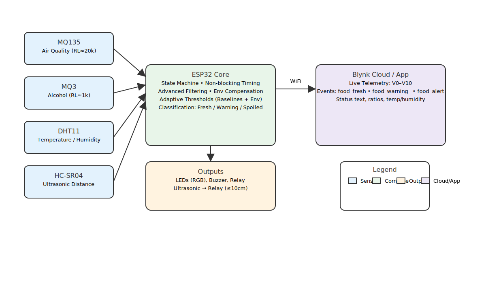
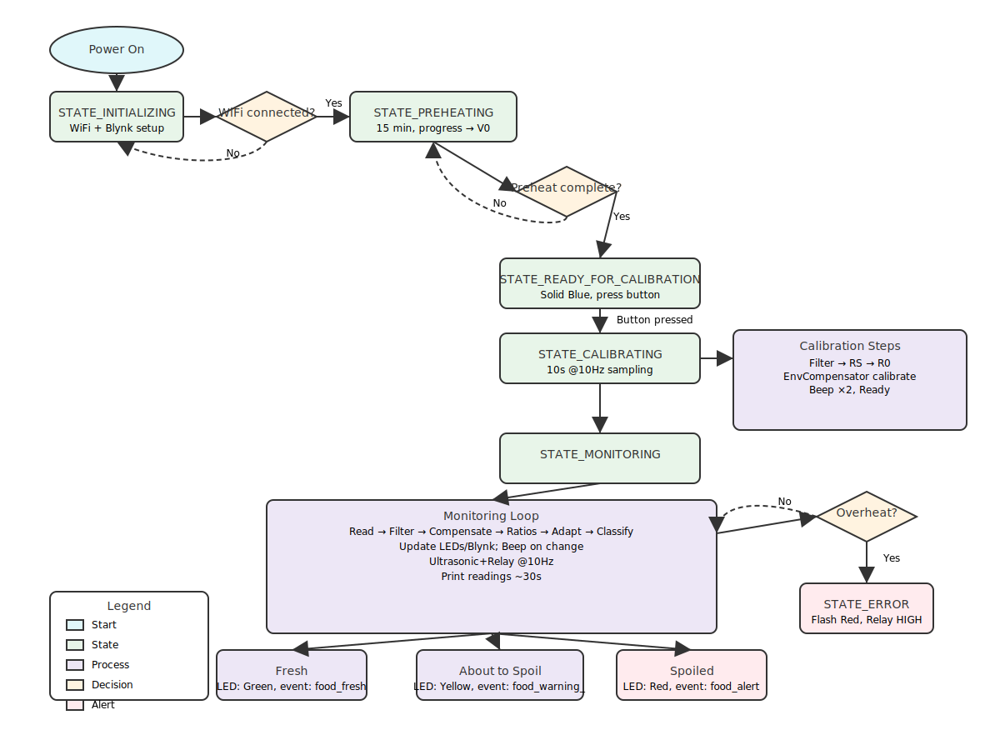
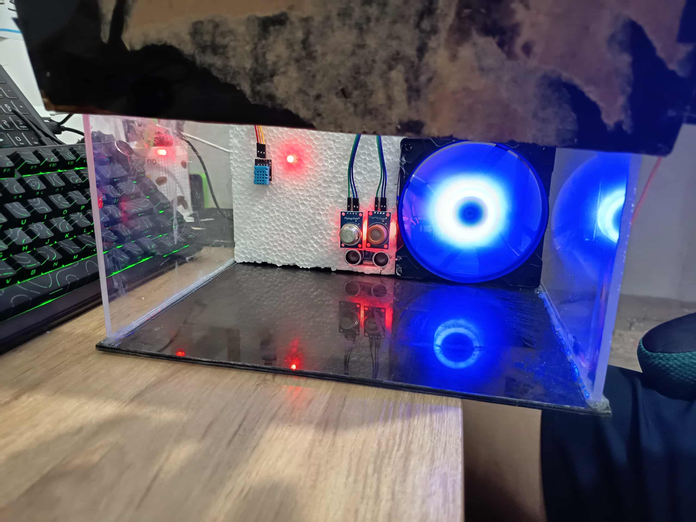
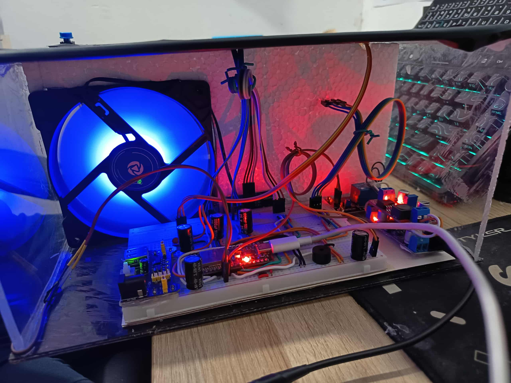
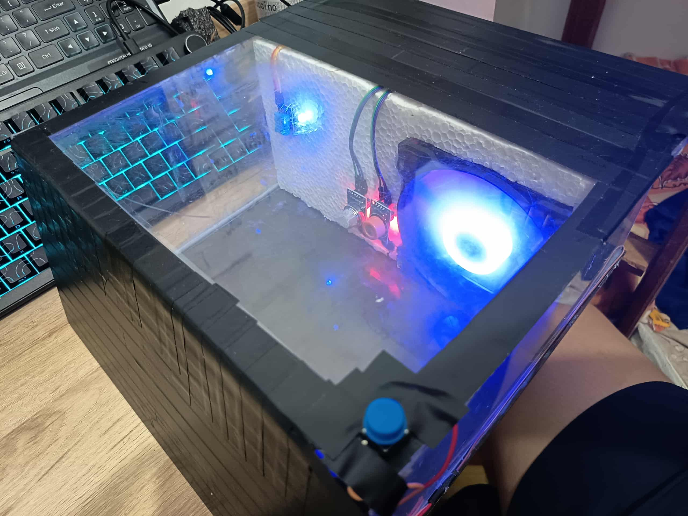
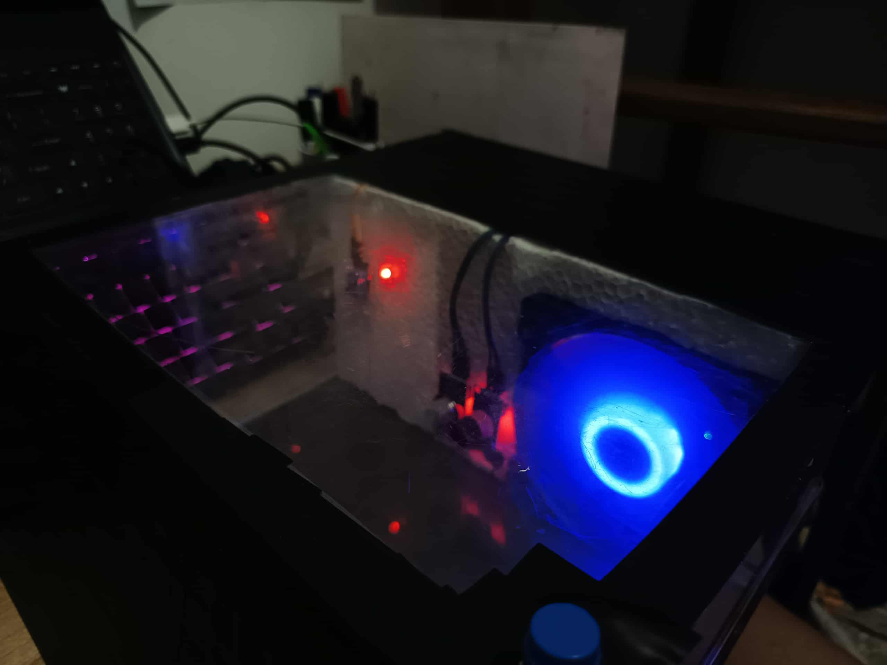
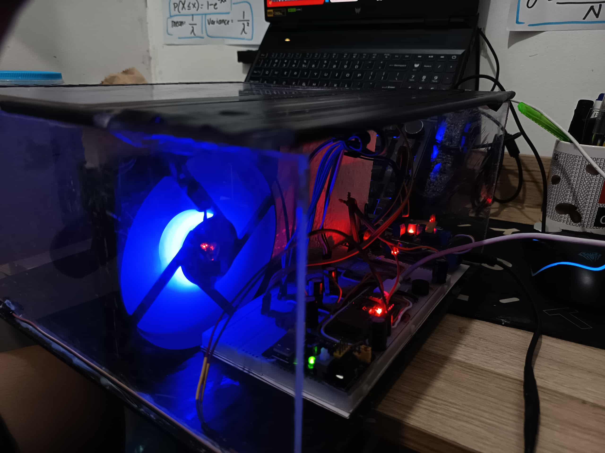
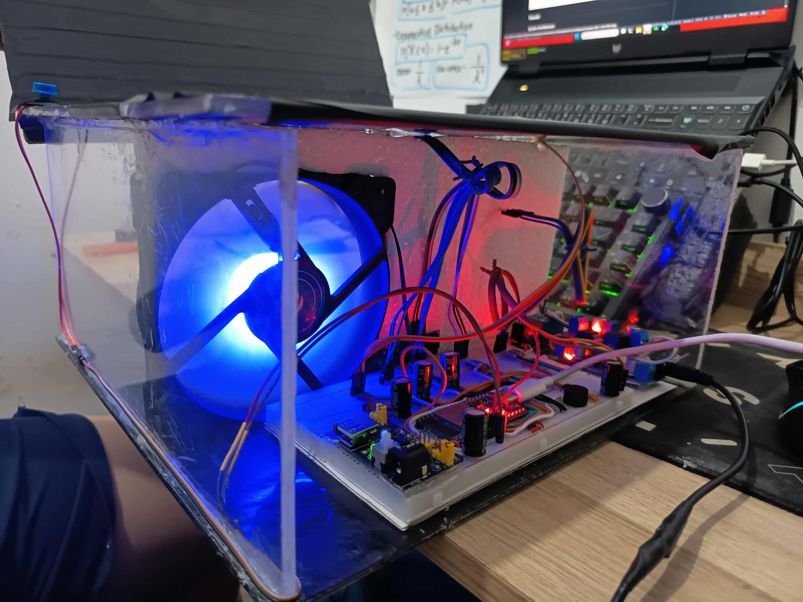

# Daryl James Padogdog was here

# Food Spoilage Detection System (ESP32)

## Circuit Diagram

## Visuals

### System Architecture

### System Flowchart

Alternative (Mermaid) version is in `FoodSpoilageSystem/docs/flowchart.md` for IDEs that support Mermaid rendering.

An optimized ESP32-based food spoilage detection system using MQ135 (air quality), MQ3 (alcohol), DHT11 (temperature/humidity), an ultrasonic sensor for proximity control, and Blynk for remote monitoring and notifications.

Key features:
- State machine architecture: Initializing → Preheating → Ready → Calibrating → Monitoring → Error
- Advanced filtering with statistical outlier handling
- Environmental compensation (temperature and humidity)
- Adaptive thresholds anchored to configurable baselines
- Non-blocking timing and responsive UI updates
- Safety monitoring (overheat protection)
- Blynk integration with status events and live telemetry

## Hardware

Components:
- `ESP32` Dev Module
- `MQ135` gas sensor (RL ≈ 20 kΩ)
- `MQ3` alcohol sensor (RL ≈ 1 kΩ)
- `DHT11` temperature/humidity sensor
- `HC-SR04` ultrasonic sensor
- `LEDs` (Red, Green, Blue)
- `Buzzer`
- `Button` (calibration trigger)
- `Relay` (controlled by ultrasonic proximity)

Pin mapping (ESP32):
- `MQ135_PIN` = 35
- `MQ3_PIN`   = 34
- `DHT_PIN`   = 19
- `RED_LED`   = 12
- `GREEN_LED` = 14
- `BLUE_LED`  = 27
- `BUZZER_PIN`= 26
- `BUTTON_PIN`= 33 (INPUT_PULLUP)
- `TRIG_PIN`  = 16 (ultrasonic)
- `ECHO_PIN`  = 17 (ultrasonic)
- `RELAY_PIN` = 25

Other constants:
- `DETECTION_DISTANCE` = 10 cm
- `MAX_TEMP` = 80.0 °C (safety cut-off)

## Software Requirements

- Arduino IDE (with ESP32 board support installed)
- Libraries:
  - `DHT sensor library`
  - `Blynk` (ESP32)
  - `WiFi` (bundled with ESP32 core)

## Configuration

- Set WiFi credentials in `sketch_nov4b.ino`:
  - `char ssid[] = "YOUR_WIFI";`
  - `char pass[] = "YOUR_PASSWORD";`
- Set Blynk credentials:
  - `#define BLYNK_TEMPLATE_ID "..."`
  - `#define BLYNK_TEMPLATE_NAME "..."`
  - `#define BLYNK_AUTH_TOKEN "..."`

## Build & Upload

1. Open `FoodSpoilageSystem/sketch_nov4b.ino` in Arduino IDE.
2. Select `ESP32 Dev Module` (or matching ESP32 board).
3. Install required libraries via Library Manager.
4. Fill WiFi and Blynk credentials.
5. Upload to the board and open Serial Monitor at `115200` baud.

## System States

- `STATE_INITIALIZING`
  - Configures pins, ADC, starts WiFi and Blynk.
  - Red LED blinks until WiFi connects.
- `STATE_PREHEATING`
  - Preheats MQ sensors for 15 minutes (`PREHEAT_TIME = 900000 ms`).
  - Progress shown on Blynk `V0`, serial logs show time remaining.
  - Red/Blue alternating LED pattern.
- `STATE_READY_FOR_CALIBRATION`
  - Solid Blue LED.
  - Press the button to start calibration; `V7` shows readiness.
- `STATE_CALIBRATING`
  - Samples sensors for 10 seconds at 10 Hz.
  - Computes filtered averages and `R0` values (clean-air baselines).
  - Calibrates environmental compensator with current temp/humidity.
  - Double beep on completion; moves to Monitoring.
- `STATE_MONITORING`
  - Non-blocking loop performing: read → filter → compensate → ratios → adapt → classify → update UI/LED/Blynk.
  - Beeps on status changes, periodic serial prints.
- `STATE_ERROR`
  - Overheat or other critical failures; flashes Red LED and disables normal operations.

## Classification & Thresholds

### At a Glance
- ✅ Fresh: safe to eat
- ⚠️ About to Spoil: consume soon
- 🚨 Spoiled: do not consume

### Thresholds (per sensor)
| Sensor | Fresh Range | Warning Range | Spoiled Threshold |
|---|---|---|---|
| MQ135 | 2.8 – 3.5 | 2.4 – 2.7 | ≤ 2.3 |
| MQ3   | 51.0 – 65.0 | 44.0 – 50.0 | ≤ 43.0 |

### How We Calculate Ratios
- `V = (filteredADC / 4095.0) * 3.3` (ESP32 12‑bit ADC)
- `RS = ((3.3 - V) / V) * RL`
- `R0_MQ135 = RS_MQ135 / 3.6` (during calibration)
- `R0_MQ3   = RS_MQ3 / 60.0` (during calibration)
- Ratio shown in app: `RS / R0` for each sensor

### Adaptive Behavior (auto‑adjusts for environment)
- `environmentalFactor = (1 + 0.01*(temp − 25)) * (1 + 0.002*(humidity − 50))`
- Target: `spoiledTarget = spoiledBaseline × environmentalFactor`
- Update: `spoiledThreshold += (target − spoiledThreshold) × adaptationRate`
- `adaptationRate = 0.05` (smooth, stable changes)

### LEDs & Alerts
- ✅ Fresh → Green LED • Blynk event: `food_fresh`
- ⚠️ About to Spoil → Yellow LED (Red+Green) • Blynk event: `food_warning_`
- 🚨 Spoiled → Red LED • Blynk event: `food_alert`

### Constructor Snapshot (from `CODE/sketch_nov4b/sketch_nov4b.ino` L210–219)
- `adaptationRate = 0.05`
- `mq135Thresholds = {freshMin: 2.8, freshMax: 3.5, warningMin: 2.4, warningMax: 2.7, spoiledThreshold: 2.3}`
- `mq3Thresholds  = {freshMin: 51.0, freshMax: 65.0, warningMin: 44.0, warningMax: 50.0, spoiledThreshold: 43.0}`
- `spoiledBaseMQ135 = mq135Thresholds.spoiledThreshold`
- `spoiledBaseMQ3   = mq3Thresholds.spoiledThreshold`

## Blynk Virtual Pins

- `V0`  Preheat progress
- `V1`  MQ135 raw (filtered ADC)
- `V2`  MQ3 raw (filtered ADC)
- `V3`  Temperature (°C)
- `V4`  Humidity (%RH)
- `V5`  Status text
- `V6`  Buzzer off (toggle)
- `V7`  Button status / prompts
- `V8`  MQ135 ratio
- `V9`  MQ3 ratio
- `V10` Calibration progress

## Safety & Proximity

- `safetyMonitor()` enforces `MAX_TEMP`; on exceed, enters `STATE_ERROR`.
- `updateUltrasonicRelay()` drives the relay HIGH when distance ≤ `DETECTION_DISTANCE` (10 cm).

## Tuning

- Threshold baselines: change values in `AdaptiveThresholdManager` constructor.
- Adaptation rate: `adaptationRate` in the same class (default `0.05`).
- Preheat and calibration durations: `PREHEAT_TIME`, `CALIBRATION_TIME`.
- Buzzer: toggle via Blynk `V6` (beeps on status change).

## File Structure

- `sketch_nov4b.ino` — main program
- `docs/flowchart.md` — Mermaid flowchart of system logic
- `docs/system_step_by_step.md` — step-by-step runtime walkthrough

## Tips

- Calibrate in clean air, away from strong odors or alcohol.
- Let MQ sensors fully preheat for best stability.
- Keep ESP32 ADC attenuation set (`ADC_11db`) as in code for consistent readings.

## Documentation Gallery

Below are build photos collected during development.

  

  

  

  

  

  

